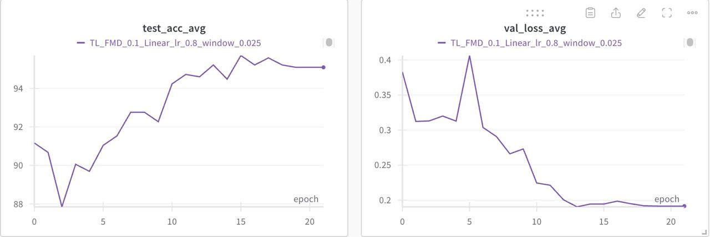

# Training with data pruning

We provide some logs files as well as visualization.

## Different datasets
We train with $10\%$ of the total data on different datasets. 
On the MNIST dataset, in ```DeepCore/deepcore/logs/tl_mnist.log```.

On the CIFAR-10 dataset, in ```DeepCore/deepcore/logs/tl_cifar10.log```.

On the FMD dataset, in ```DeepCore/deepcore/logs/tl_fmd.log```.

On the DermaMNIST dataset, in ```DeepCore/deepcore/logs/tl_derma.log```.

On the SNIPS dataset, in ```DeepCore/deepcore/logs/tl_snips.log```.


For detailed log of training, please refer to the log files.

## Different pruninig ratio
Different ratios on the CIFAR-10 dataset.


Different ratios on the MNIST dataset.


Log files will generated when executing the scripts. Sample log files in ```DeepCore/deepcore/logs/tl_cifar10_0.01.log```.