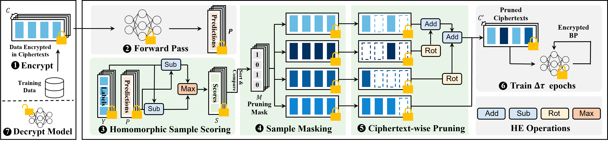
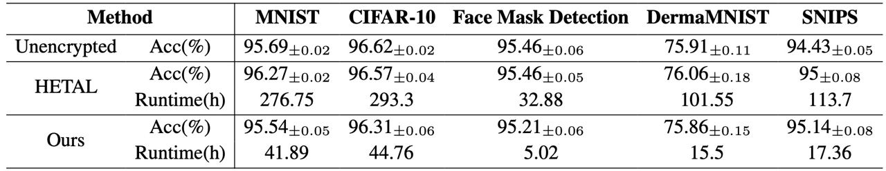
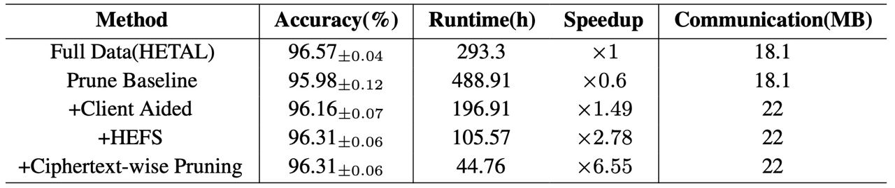
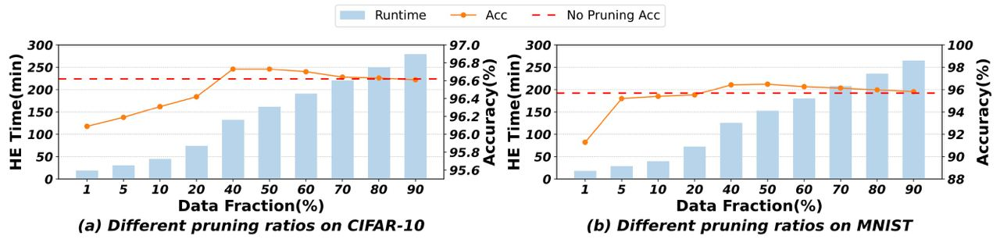
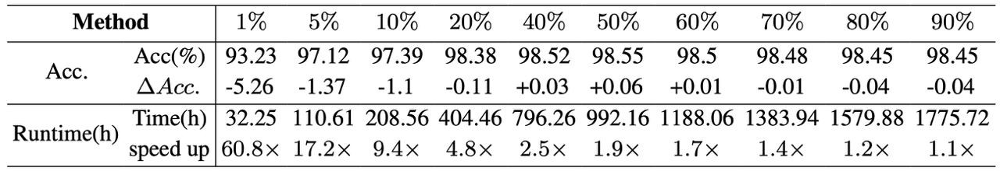

# HEPrune: Fast Private Training of Deep Neural Networks with Encrypted Data Pruning

This is the repository for HEPrune: Fast Private Training of Deep Neural Networks With Encrypted Data Pruning (Neurips'24). This implementation is based on the [OpenFHE](https://github.com/openfheorg/openfhe-development), [DeepCore](https://github.com/PatrickZH/DeepCore) libraries and the encrypted training framework from [HETAL](https://github.com/CryptoLabInc/HETAL/tree/main).



# Installation
Conda is used to manage different environments across the libraries. Please follow the instructions below to install the libraries. 

## OpenFHE
We recommend to install the OpenFHE library with Intel HEXL acceleration. There are multiple installation configurations for OpenFHE. We refer the user to their [documentation](https://github.com/openfheorg/openfhe-development/blob/main/docs/static_docs/Best_Performance.md) for more details. Below is the configuration we used for our experiments.

First clone the OpenFHE configurator:

    git clone https://github.com/openfheorg/openfhe-configurator.git

Switch into the ```openfhe-configurator``` directory and run:

    scripts/configure.sh

For the prompt, choose as follows:

    Would you like to stage an openfhe-development build?     [y/n] : n
    Would you like to stage an openfhe-hexl build?            [y/n] : y

After successful configuration, you should see the prompt:

    Build [hexl-enabled] is staged.
    You may now run scripts/build-openfhe-development.sh to perform a hexl-enabled build.

Then, run the script:

    scripts/build-openfhe-development.sh

Upon successful installation, you should see:

    Building openfhe-development [COMPLETE]

You can install the OpenFHE library in another location than within this project. With proper installation, you can use OpenFHE under the ```./HEPrune``` directory. To build the test files for HEFS and ciphertext-wise pruning, switch to the ```./HEPrune/build``` and then run:

    cmake ..
    make

The executable files will be in ```./HEPrune/build/bin```

## DeepCore

To run the data pruning experiments within ```./DeepCore```, only basic PyTorch packages are needed. You can install them as indicated in the ```requirements.txt```.

## HEaaN

Fisrt switch to the ```./HETAL``` directory. Then install the ```heaan_sdk-0.2.0-cp38-cp38-linux_x86_64.whl``` and ```heaan-0.1.0+cpu-cp38-cp38-linux_x86_64.whl```. Specifically, create a Python 3.8 evcironment with:

    conda create -n hetal python=3.8

Then, activate the environment and install the .whl files with pip:

    conda activate hetal
    pip install heaan_sdk-0.2.0-cp38-cp38-linux_x86_64.whl
    pip install heaan-0.1.0+cpu-cp38-cp38-linux_x86_64.whl

# Dataset

We use 5 datasets to test the performance of HEPrune.

* MNIST
* CIFAR-10
* [DermaMNIST](https://www.nature.com/articles/s41597-022-01721-8)
* [Face Mask Detection](https://www.kaggle.com/datasets/andrewmvd/face-mask-detection)
* [SNIPS](https://arxiv.org/pdf/1805.10190v3.pdf)

For the transfer learning setting, we use a ViT-base model to extract the features of the data as a vector of dimension 768. More details about the feature extraction can be found [here](https://github.com/CryptoLabInc/HETAL/blob/main/src/hetal/README.md). For the training from scratch setting, we use the MNIST dataset. We recommend putting the datasets under the ```./data``` directory, as it is needed in experiments on both accuracy (in ```./`DeepCore```) and latency (in ```./`HETAL```). Alternatively, you can download the data from [here](https://drive.google.com/file/d/1924w5WMulmgVMRXIGP80wIs-ot28b2-K/view?usp=sharing). 

# How to use

We offer a step-by-step guide for reproducing the results in the paper. The private training with encrypted pipeline includes (1) importance score computation, i.e., computing the HEFS; (2) client aided masking, i.e., generating the pruning mask in the plaintext on the client's side; (3) ciphertext-wise pruning, i.e., merging sparse ciphertexts into dense ones according to the pruning mask. We test the accuracy and latency separately. This is because HETAL is built upon the HEaaN library, which mainly contains API calls and is currently not fully open-sourced. Our implementation can be extended to an end-to-end framework by rewriting HETAL in an open-sourced library like OpenFHE. Since this work does not focus on optimizing the building blocks in the HETAL framework, e.g., matrix multiplication and SoftMax, we leave that for future development.

## Test the accuracy
To test the accuracy on different datasets with different pruning ratios, please switch to the ```./DeepCore``` directory. We test 5 datasets. You should first prepare all datasets under the ```./data``` directory. Then run:

    model="Linear"
    selections="AdaEL2NL1"
    fraction=0.1
    lr=0.5
    num_experiments=1
    datasets=("TL_CIFAR10" )
    data_paths=("../data/cifar10")
    classes=(10)

    for n in 1; do
        for (( i=0; i<num_experiments; i++ )); do
            dataset=${datasets[$i]}
            data_path=${data_paths[$i]}
            num_classes=${classes[$i]}
            for selection in $selections; do
                CUDA_VISIBLE_DEVICES=0,1 python3 -u tl_main.py \
                --fraction "$fraction" \
                --select_every 5 \
                --dataset "$dataset" \
                --data_path "$data_path"\
                --warm_epoch 0 \
                --num_exp 1 \
                --workers 10 \
                --optimizer SGD \
                -se 10 \
                --selection "$selection" \
                --model "$model" \
                --lr "$lr" \
                --save_path ./result \
                --batch 128 \
                --epochs 20 \
                --scheduler CosineAnnealingLR\
                --in_dim 768\
                --num_classes "$num_classes"
            done
        done
    done

To test the accuracy on different datasets with different pruning ratio, simply change the correponding parameters.

## Test the latency
The latency is tested component-wise. The runtime mainly consists of 4 parts: (1) The forward pass and backpropagation, i.e., computing the probability vector that is needed for HEFS, as well as the gradients. (2) Computing the HEFS score on the server side. (3) Generating the pruning mask on the client side. (4) Performing the ciphertext-wise pruning on the server side.

### Encrypted forward pass and backpropagation
In essence, this component evaluates the matrix multiplication and the SoftMax function (via polynomial approximation) in the encrypted state on the server side, where the main HE operations are ciphertext-ciphertext multiplication, rotation and bootstrapping. These are implemented and optimized by HETAL. To test the latency of this part, switch in ```./HETAL``` directory. We use a batch size of 128. To test the latency of training one epoch on one batch in the encrypted state, under ```./HETAL/src/hetal```, run:

    python run.py --data mnist --num_epoch 1 --generate_keys --encrypted_train --batch_size 128

### Computing the HEFS score
Computing the HEFS score needs the max and rotation operations. We implement this part in ```./HEPrune/hefs.cpp```. HEFS takes as input the encrypted prediction vector and ground truth label, and outputs the encrypted HEFS score. After building, you can test HEFS on the CIFAR-10 dataset with:

    ./bin/hefs cls=10 ctn=342
where cls represents the number of classes in the dataset and ctn is the number of ciphertexts used to encrypt the prediction vector. The number of classes determines the number of rotations needed during score evaluation. The overall latency is linear with respect to the number of ciphertexts.

### Generating the pruning mask
Generating the pruning mask is done on the client side. Note that the client can access the importance score in plaintext. This is in essence evaluating the QuickSelect algorithm in the plaintext. When training with data pruning using scripts in ```./DeepCore```, one can save the importance scores and then load into the function in ```./HEPrune/cam.cpp```. We show how the pruning mask can be generated given the plaintext importance score. After building, you can test CAM on the CIFAR-10 dataset with: 

    ./bin/cam nsample=43750 p=0.4
where nsample represents the number of data samples (and importance scores) and p the keeping ratio (p=0.4 means that 40% of the data is kept).
 
### Ciphertext-wise pruning
Ciphertext-wise pruning takes the encrypted dataset and pruning mask as input, and merges sparse ciphertext into dense ones. We implement this part in ```./HEPrune/cwp.cpp```. After building, you can test CWP on the CIFAR-10 dataset with: 

    ./bin/cwp batch=128 ctn=342 p=0.4
where batch is the batch size, ctn is the number of ciphertexts and p is the keeping ratio. The number of rotation needed in CWP is determined by the pruning mask.

While the component-wise calculation is not exactly accurate, it effectively reflects the runtime of the encrypted data pruning in private training. The CAM is performed in the plaintext, which incurs marginal overhead. The HEFS and CWP are also efficient compared with the forward pass and backpropagation.

## Reproducing the results
See more detailed scripts in ```DeepCore/datasets.sh``` and ```DeepCore/ratio.sh```. And see the log files and README in ```DeepCore/deepcore/logs```.
### Experiments on different datasets
Follow above instructions to test the accuracy and latency of training on different datasets with pruninig ratio $p=0.9$. Take the CIFAR-10 data set for an example. Run ```DeepCore/datasets.sh``` to get the results. According to the number of epochs and number of data pruning needed, run the scripts for HE codes in ```HEPrune/run.sh``` to get the latency of encrypted data pruning. Run ```HETAL/src/hetal``` to get the latency of private training.


### Ablation on CIFAR-10
This is a part of the scripts in ```DeepCore/datasets.sh```. Only 10% of the CIFAR-10 dataset is remained. The Prune baseline is approximated because $O(N^2)$ HE-based swap is needed when CAM is not used, which is prohibitive in practice.


### Different pruning ration on CIFAR-10 and MNIST
Run ```DeepCore/ratio.sh``` to get the results. The latency is computed in the same way as experiments on different datasets. Run the scripts for HE codes in ```HEPrune/run.sh``` to get the latency of encrypted data pruning. Run ```HETAL/src/hetal``` to get the latency of private training.


### Training from scratch
Run ```DeepCore/tfs_run.sh``` to get the results. The overhead of performing data pruning is the same as in the transfer learning setting, which is mainly decided by the size of the dataset and the pruning ratio (as shown in ```HEPrune/run.sh```). The forward pass is more expensive. The Forward pass should be tested in ```HETAL/src/hetal```.

